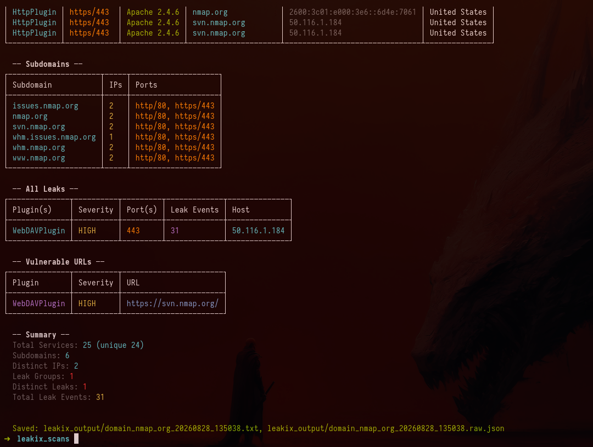
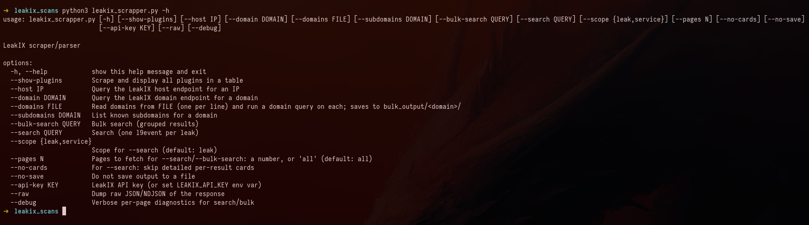
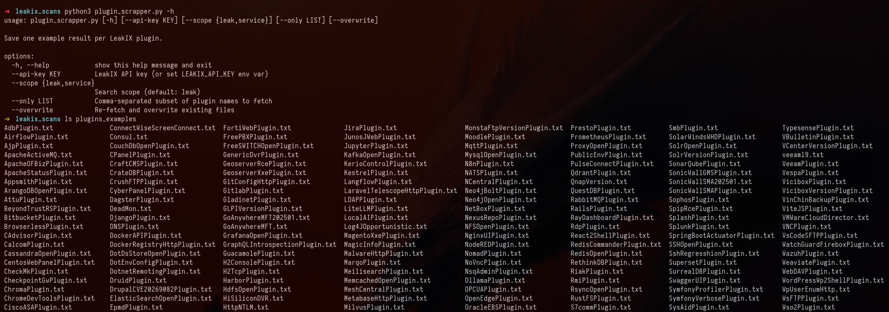

<h1 align="center">
  🛰️<br>
  LeakIX Parser
</h1>

<h4 align="center">Two scripts that turn the LeakIX API into something you can read.<br>One reads the whole plugin catalogue. The other reads your target.</h4>

<div align="center">

     

</div>

<div align="center">

[Quick start](#quick-start) &nbsp;•&nbsp; [A look around](#a-look-around) &nbsp;•&nbsp; [leakix_scrapper.py](#leakix_scrapperpy--recon-on-a-target) &nbsp;•&nbsp; [plugin_scrapper.py](#plugin_scrapperpy--the-plugin-cookbook) &nbsp;•&nbsp; [Query syntax](#query-syntax) &nbsp;•&nbsp; [Output files](#what-lands-on-disk)

</div>

---

📋 **Tables, not JSON.** Services, subdomains, leak groups, vulnerable URLs — each one a box-drawn table with severity in colour.<br>
🔗 **Vulnerable URLs, reconstructed.** Protocol, host, port and path stitched back together, with the resource hostname substituted when the event only carries an IP.<br>
📖 **A local reference for all 246 plugins.** One real example each, so you know what a `DotEnvConfigPlugin` hit actually looks like before you go hunting for one.<br>
📂 **A domain list in, a folder tree out.** `--domains targets.txt` runs the lot and files each one under `bulk_output/<domain>/`.<br>
🐢 **Polite by construction.** A single global rate limiter — one request per 1.1s — shared by every code path. Pagination stops itself on duplicates and hard caps.<br>
💾 **Every run saved twice.** The rendered report as `.txt` with ANSI stripped, the untouched response as `.raw.json`, both timestamped.

<br>

## A look around

<p align="center">
  
</p>
<p align="center"><em>The tail of <code>--domain nmap.org</code>. Six subdomains, one HIGH WebDAV leak across 31 events, the exact URL to look at — and both output files named on the way out.</em></p>

<br>

<p align="center">
  
</p>
<p align="center"><em><b>One entry point, seven modes.</b> A host, a domain, a file of domains, subdomains, a search, a bulk search, or the plugin index.</em></p>

<br>

<p align="center">
  
</p>
<p align="center"><em><b>246 plugins, 246 files.</b> <code>AdbPlugin</code> through <code>Wso2Plugin</code> — one real, complete example of each, on disk, greppable, no API key needed to read them again.</em></p>

<br>

## Quick start

```bash
pip install requests beautifulsoup4
export LEAKIX_API_KEY="your-key-from-leakix.net/settings/git"

python3 leakix_scrapper.py --domain nmap.org        # everything on a domain
python3 leakix_scrapper.py --host 50.116.1.184      # everything on an IP
python3 plugin_scrapper.py                          # build the local plugin reference
```

Both scripts take `--api-key KEY` if you would rather not use the environment
variable. Only `--show-plugins` works without a key — it scrapes the public
plugin index page.

> [!TIP]
> Add `--no-save` while you are still deciding what to query, or you will fill
> `leakix_output/` with experiments.

<br>

## `leakix_scrapper.py` — recon on a target

Pick exactly one mode per run.

| | |
| --- | --- |
| `--domain DOMAIN` | The domain endpoint: services, subdomains, leak groups, summary |
| `--host IP` | The host endpoint: the same treatment for a single address |
| `--domains FILE` | A domain per line — queries each, one folder each under `bulk_output/` |
| `--subdomains DOMAIN` | Known subdomains, newest first, with distinct-IP counts |
| `--search QUERY` | One `l9event` per leak, paginated to exhaustion |
| `--bulk-search QUERY` | Grouped results — one record per resource, its events folded in |
| `--show-plugins` | The plugin index as a table. No API key needed |

And the modifiers:

| | |
| --- | --- |
| `--scope leak\|service` | `leak` finds findings, `service` finds exposed services (default `leak`) |
| `--pages N` \| `all` | How deep to paginate a search (default `all`) |
| `--no-cards` | Skip the per-result detail cards, keep the tables |
| `--raw` | Dump the JSON/NDJSON instead of rendering it |
| `--no-save` | Print only, write nothing |
| `--debug` | Per-page counts: raw, new, unique, first IP |

### What a domain run gives you

Leaks first, then services, then the tables that let you scan the whole thing at
once — **All Services**, **Subdomains**, **All Leaks**, **Vulnerable URLs** —
and a counted **Summary**. Each leak group is a card:

```
══════════════════════════════════════════════════════════════════════════════
 WebDAVPlugin  443
──────────────────────────────────────────────────────────────────────────────
  IP: 50.116.1.184
  Resource: svn.nmap.org
  Open Ports: 443
  Leak Events: 31
  Severity:  HIGH
  Org: Linode, LLC (AS63949)

  Vulnerable URLs:
    WebDAVPlugin [HIGH] https://svn.nmap.org/
```

### A list of domains at once

```bash
python3 leakix_scrapper.py --domains targets.txt
```

Blank lines and `#comments` are skipped, duplicates dropped, order kept. Each
domain gets a fresh output buffer, so `bulk_output/<domain>/` holds that domain
and nothing else:

```
bulk_output/
  nmap_org/
    domain_nmap_org_20260828_135038.txt
    domain_nmap_org_20260828_135038.raw.json
  example_com/
    domain_example_com_20260828_135041.txt
    domain_example_com_20260828_135041.raw.json
```

A domain that errors prints the error in red and the run **continues** to the
next one — a dead host in the middle of a 200-line list does not cost you the
other 199.

### Pagination that knows when to stop

`--search` and `--bulk-search` walk pages until the results stop being new.
Search dedupes on `(fingerprint, ip, host, port, time)` and stops on the first
empty page; bulk dedupes on fingerprint set — falling back to
`(resource_id, ip, ports)` — and stops after two consecutive pages of nothing
new. Safety caps of 5000 and 200 pages sit behind that in case the API keeps
happily serving the same page forever.

The search summary tells you how the sausage was made:

```
  Raw Results (all pages): 1204
  Unique Results: 318
  Duplicates Removed: 886
  Pages Fetched: 13
```

<br>

## `plugin_scrapper.py` — the plugin cookbook

LeakIX ships 246 detection plugins. Their names tell you roughly nothing about
what a hit looks like. This walks the whole list, pulls one live example per
plugin, and writes it to `plugins_examples/{PluginName}.txt`.

```bash
python3 plugin_scrapper.py
```

```
Fetching one example for 246 plugins (scope=leak)...

[246/246] ZyxelVersion: saved

Done. saved=244  no_results=2  skipped=0  errors=0
Files in: plugins_examples/
```

Each file is a flat card — IP, domain, port, reconstructed URL, geo, ASN,
software and version, severity, leak type, dataset size, TLS CN and SANs, and
the plugin's own wrapped summary:

```
Plugin: DotEnvConfigPlugin
Event Source: DotEnvConfigPlugin

  IP: 203.0.113.42
  Domain: app.example.com
  Port: 443
  URL: https://app.example.com/.env
  Location: Frankfurt am Main, Germany
  Org: Hetzner Online GmbH (AS24940)
  Software: nginx 1.18.0
  Severity: HIGH
  Leak Type: config
  Summary:
    Found .env file with 14 keys including APP_KEY, DB_PASSWORD...
```

| | |
| --- | --- |
| `--scope leak\|service` | Which side of the index to pull the example from |
| `--only A,B,C` | Just these plugins. Warns about names not in the index |
| `--overwrite` | Re-fetch files that already exist |

Runs are **resumable by default**: existing files are skipped, so a run
interrupted at plugin 180 picks up where it left off. Plugins with no current
results get a stub file saying so — the difference between *checked and empty*
and *never checked* is worth keeping.

At one request per 1.1 seconds, a full catalogue sweep takes about five minutes.

<br>

## Query syntax

`--search` and `--bulk-search` pass your string to LeakIX untouched, so the
site's own query language applies:

```bash
--search '+plugin:DotEnvConfigPlugin'
--search '+country:"Romania" +severity:high'
--search 'ip:"203.0.113.0/24"' --scope service
--bulk-search '+plugin:GitConfigHttpPlugin +country:"Germany"'
```

Mind your shell quoting — `+` and `:` survive single quotes; unquoted they may
not.

<br>

## What lands on disk

```
leakix_output/                                   single-target runs
  domain_nmap_org_20260828_135038.txt              rendered report, ANSI stripped
  domain_nmap_org_20260828_135038.raw.json         the response, untouched
  search__plugin_DotEnvConfigPlugin_….txt
  search__plugin_DotEnvConfigPlugin_….raw.json
bulk_output/<domain>/                            one folder per --domains entry
plugins_examples/                                the plugin reference
  DotEnvConfigPlugin.txt
  … 245 more
```

Names are `{kind}_{slug}_{UTC timestamp}`, so nothing overwrites anything and
runs sort chronologically. The `.txt` is exactly what you saw in the terminal
with the colour codes removed; the `.raw.json` is NDJSON for paginated modes and
pretty-printed JSON for the single-shot endpoints — feed it to `jq` and build
whatever you actually need.

<br>

## Notes on behaviour

- **Rate limiting is global and unconditional.** `_rate_limit()` sits inside
  `query_api()`, so every request in every mode goes through it. There is no
  flag to turn it off, on purpose — LeakIX allows roughly one request a second.
  A 200-domain `--domains` run therefore takes about four minutes of waiting.
- **Two dedupe layers.** Fetchers dedupe across pages; the renderer dedupes
  again on `(fingerprint, host, ip, port, leak type)` before printing, which is
  why the summary reports both total and unique service counts.
- **URL reconstruction is a guess where it has to be.** Non-HTTP protocols fall
  back to `https` on port 443 and `http` otherwise, and default ports are
  omitted from the netloc.
- **Modes do not combine — the first match wins.** `main()` checks them in this
  order: `--show-plugins`, `--search`, `--bulk-search`, `--subdomains`,
  `--domains`, then `--host`/`--domain`. So `--domains` beats `--domain`, and a
  stray `--search` silently beats everything after it.
- **`--show-plugins` scrapes HTML**, matching on Bootstrap `col-sm-3` /
  `col-sm-6` row structure. If LeakIX redesigns that page, that one mode breaks
  while everything else keeps working.

---

<div align="center">
<sub>Recon against systems you are authorised to test. LeakIX indexes the public internet; that is not the same as permission.</sub>
</div>
